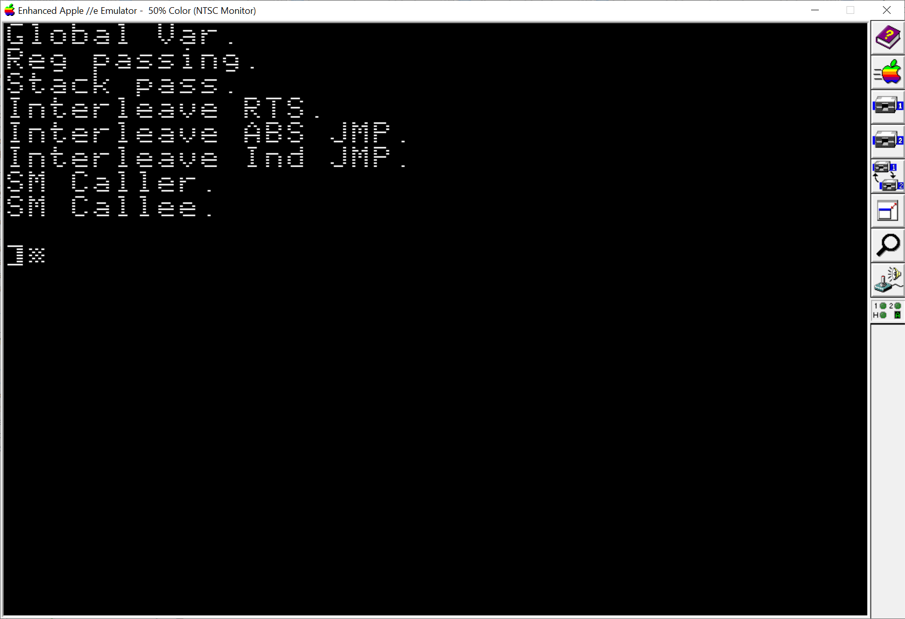

# Passing arguments to a 6502 assembly language function



There are different ways assembly code can pass an argument to a function.
Each of these are known as a "calling convention". 

There are 5 different ways to pass an argument to a function in 6502 assembly
language.  Sorted from simplest to complex:

1. Pass by (global) Variable
2. Pass by Register
3. Pass by Stack
4. Pass by PC
5. Pass by (Self-Modifying) Code

Technically, there is a sixth, _Pass by Local Variable,_ but since the local/global
distinction is more of a concept then an actual difference due to there being
only a single adress space used by the 602 CPU we'll just lump it under
_pass-by-var_ or _pass-by-code._

Also, there is no reason why you can't even _combine_ these! For example,
the equivalent of C's `putchar()`on the Apple 2 is`COUT` located at $FDED.  The
`A` register passed in is the character to output to the screen.  `COUT` also
uses global variables on the zero-page that track the cursor row, column, along
with a 16-bit pointer to video memory where the next character will go.

# Example function

First we'll define a demo function.  It is just a simple routine to
print an ASCIIZ string (traditional C-style null terminated).

We'll assume strings can't be longer then 255 characters. Given that the
Apple 2 has a screen width of either 40-columns or 80-columns this seems
reasonable.  (If we wanted to extended this function to print strings longer
then 255 characters it is trivial to extend.  Instead of the usual
_Exercise left for the reader_ bullshit excuse see Appendix A for a solution.)

A string is just an array of bytes.  The 6502 has some really nice addressing
modes that makes dealing with arrays < 256 bytes really simple:

* `LDA $abs,X` and
* `LDA (ptr), Y`


```asm
; ROM Entry Points
COUT    EQU $FDED

; Globals
zText   EQU $FE

        ORG $800

;================================
; ON ENTRY:
;     zText+0 = Lo address of string to print
;     zText+1 = Hi address of string to print
; ON EXIT:
;     A = 00
;     Y = String Length (not counting NULL terminator)
;================================
PrintString
        LDY #0
]Print  LDA (zText),y
        BEQ :Done
        JSR COUT
        INY
        BNE ]Print
:Done   RTS
```

# 1. Pass by Variable

No surprises here. We get the address of the string, set a global var, and call
our function (to print it.) Merlin32 has `<` and `>` operators to get the low
and high byte of a 16-bit address, respectively.

```asm
        ORG $800

PassByGlobal
        LDX #>TextG         ; High byte 16-bit address
        LDY #<TextG         ; Low  byte 16-bit address
        STX zText+1
        STY zText+0
        JSR PrintString
        RTS

;================================
; ON ENTRY:
;     zText+0 = Lo address of string to print
;     zText+1 = Hi address of string to print
; ON EXIT:
;     A = 00
;     Y = String Length (not counting NULL terminator)
;================================
PrintString
        LDY #0
]Print  LDA (zText),y
        BEQ :Done
        JSR COUT
        INY
        BNE ]Print
:Done   RTS

TextG   ASC "Global Var." ,8D,00
```

Notice anything "wrong" with this code?

From a _functional_ point-of-view it works.

The problem is that all those extra stores ...

```
    STX zText+1
    STY zText+0
```

... bloat our code _every_ time we call our function. Since this is common code
we can factor it out and move it into its own function prologue.  Which leads us
to our next calling convention.


# 2. Pass by Register

As mentioned a nice, small solution is to pass a 16-bit address in the X,Y regs.

What is nice that we can "prepend" this small 4-byte function to our regular
PrintString function since it is common code and we just "fall into" our
printing function.

```asm
        ORG $300

PassByRegs
        LDX #>TextR         ; High byte 16-bit address
        LDY #<TextR         ; Low  byte 16-bit address
        JSR PrintStringXY
        RTS

;============================
; ON ENTRY:
;     X = Hi address of string to print
;     Y = Lo address of string to print
;============================
PrintStringXY
        STX zText+1
        STY zText+0
        ; *** INTENTIONAL FALL INTO PrintString ***

;============================
; ON ENTRY:
;     zText+0 = Lo address of string to print
;     zText+1 = Hi address of string to print
; ON EXIT:
;     A = 00
;     Y = String Length (not counting NULL terminator)
;============================
PrintString
        LDY #0
]Print  LDA (zText),y
        BEQ :Done
        JSR COUT
        INY
        BNE ]Print
:Done   RTS

TextR   ASC "Reg passing.",8D,00
```


# 3. Pass by Stack

In high level languages like C, Pascal, etc. the stack is commonly used
to pass arguments.  The default C calling convention is called [CDECL](https://en.wikibooks.org/wiki/X86_Disassembly/Calling_Conventions#CDECL)

i.e.
```c
int sum( int a, int b )
{
}

int main()
{
    sum( 1, 2 );
}
```

Generates this x86 / x64 assembly:

```asm
_sum:
    push ebp
    mov  ebp, esp
    mov  eax, [bp+8]
    mob  edx, [bp+12]
    :
    pop ebp
    ret

main:
    push 2
    push 1
    call _sum
    add  esp, 8
```

Notice how:

* function arguments are passed in reverse order (2 then 1), and
* the caller is responsible for cleaning up the stack.

Using the stack to pass variables usually _isn't_ usually done in 6502
since:

* there is no direct assembly instruction to add/substract a constant
 N to the stack pointer after our function call like there is on x86
 assembly such as that `add esp, 8`.  On the 6502 one would need to either
 use dummy pull instructions or use `TSX` and `TXS` to adjust the stack.

* This is slow, bloated, and complicated compared to other methods.

Using dummy `PLA` to pop the function arguments:

```asm
    PLA     ; We pushed 2 bytes onto the stack prior to our call
    PLA     ; remove arguments off of stack
```

Using `TSX` and `TXS` to adjust the stack:

```asm
    TSX     ; We pushed 3 arguments onto the stack prior to our call
    INX     ; remove arguments off of stack
    INX
    INX
    TXS
```

Again, we'll leverage existing code for a demo:

```asm
        ORG $800

PassByStack
        LDA #>TextS         ; Pass args like any high level language
        PHA                 ; such as C, Pascal, etc.
        LDA #<TextS
        PHA
        JSR PrintStringStack
        PLA                 ; Don't forget to remove our 16-bit string address
        PLA                 ; else we leak stack memory!
        RTS

;============================
; ON ENTRY:
;     [Stack] = 16-bit address of string to print
; USES: A, X, Y
;============================
PrintStringStack            ;      $100    S+1   S+2   S+3   S+4       $1FF
        TSX                 ; S = [Bot ... RetLo RetHi TxtLo TxtHi ... Top]
        LDA: $104,X         ; A = texthi
        LDY: $103,X         ; Y = textlo
        TAX
        ; *** INTENTIONAL FALL INTO PrintStringXY ***

;============================
; ON ENTRY:
;     X = Hi address of string to print
;     Y = Lo address of string to print
;============================
PrintStringXY
        STX zText+1
        STY zText+0
        ; *** INTENTIONAL FALL INTO PrintString ***

;============================
; ON ENTRY:
;     zText+0 = Lo address of string to print
;     zText+1 = Hi address of string to print
; ON EXIT:
;     A = 00
;     Y = String Length (not counting NULL terminator)
;============================
PrintString
        LDY #0
]Print  LDA (zText),y
        BEQ :Done
        JSR COUT
        INY
        BNE ]Print
:Done   RTS

TextS   ASC "Stack pass." ,8D,00
```

If the stack cleanup code is slow and bloated why even bother showing it?

For "completeness".  Don't use this in actual production code.


# 4. Pass by PC

A common calling convention is to place data after a call to a function. The
function will pop the saved PC off of the stack, process the data, and then
push an adjusted PC back on the stack and return to the caller.  This is
common for ProDOS MLI (Machine Language Interface) calls.

**Note:** MLI is a term that predates the API (Application Programming Interface) term.

The general template for this interleaving code + data is:

```asm
        JSR SomeFuncThatUsesFollowingData
        [Binary data]
        ...code continues...
```

Tradeoffs are:

```
+ Easily expandable
- Slightly extra burdon on the function for processing
- Slightly slower performance
```

In the function we call, the callee, it needs to do this housekeeping:

* Get the PC
* Process Data
* Update the PC
* RTS or JMP

We have two options for how we access the saved PC on the stack:

* Use transfer the stack pointer to the X register via`TSX` and use absolute indexex addressing `LDA $100,X`
* Pop the PC off the stack

We have three options for how we return back to the caller:

* a) Push the PC back on the stack and use a `RTS`
* b) Use an absolute `JMP $abs`
* c) Use an indirect `JMP ($indirect)`

In the example below the label `TextPC#` isn't needed. It is included so you have a symbol
in your assembler / debugger for reference.

```asm
        ORG $800

PassByPC
        JSR PrintStringPC_RTS
TextPC1 ASC "Interleave RTS.",8D,00
        JSR PrintStringPC_AbsJMP
TextPC2 ASC "Interleave ABS JMP.",8D,00
        JSR PrintStringPC_IndJMP
TextPC3 ASC "Interleave Ind JMP.",8D,00
        RTS

; Different implementations for how we can return to the original caller
;
; 1. We can simulate a JMP via pushing an address-1 on the stack
; and doing RTS
;============================
; ON ENTRY:
;     PC+1 = String to print
;============================
PrintStringPC_RTS
        PLA                 ; A = [S] = low
        TAY                 ; JSR pushes PC-1 onto stack
        INY                 ; Skip high byte of JSR in "xxxx:20 lo hi  JSR func"
        PLA                 ; A = [S] = hi
        TAX                 ; X,Y = string
        JSR PrintStringXY
FixRetAddrRTS
        LDA zText+1         ; push high return address
        PHA
        TYA
        CLC                 ; DONT'T skip NULL terminator at end of string
        ADC zText+0         ; Since RTS returns to address-1 on the stack
        PHA                 ; push low return address
        RTS                 ; Simulate JMP


; 2. Absolute JMP
;============================
; ON ENTRY:
;     PC+1 = String to print
;============================
PrintStringPC_AbsJMP
        PLA                 ; A = [S] = low
        TAY                 ; JSR to us pushes PC-1 onto stack
        INY                 ; Skip high byte of JSR in "xxxx:20 lo hi  JSR func"
        PLA                 ; A = [S] = hi
        TAX                 ; X,Y = string
        JSR PrintStringXY
FixRetAddrAbsJMP
        TYA
        SEC                 ; Skip NULL terminator at end of string
        ADC zText+0
        STA :Done+1         ; *** SELF-MODIFIES *** Fixup return address low
        BNE :SamePage
        INC zText+1
:SamePage
        LDA zText+1
        STA :Done+2         ; *** SELF-MODIFIES *** Fixup return address high
:Done   JMP $C0DE           ; **SELF-MODFIED**

; 3. Indirect JMP
;============================
; ON ENTRY:
;     PC+1 = String to print
;============================
PrintStringPC_IndJMP
        PLA                 ; A = [S] = low
        TAY                 ; JSR to us pushes PC-1 onto stack
        INY                 ; Skip high byte of JSR in "xxxx:20 lo hi  JSR func"
        PLA                 ; A = [S] = hi
        TAX                 ; X,Y = string
        JSR PrintStringXY
FixRetAddrIndJMP
        TYA
        SEC                 ; Skip NULL terminator at end of string
        ADC zText+0
        STA zText+0
        BNE :SamePage
        INC zText+1
:SamePage
        JMP (zText)
```

The fixup return addres re-uses the 16-bit pointer to the text string.

# 5. Pass by Self-Modifying Code

This is similiar to pass-by-variable except we modify the function we are calling.
This works because the 6502 is only single threaded and has no I$ (Instruction
cache.)

There are actual 2 ways we can implement this:

* Have the caller modify the code (which is bulky), or
* Have the callee modify the code (minimizes bloat).

```asm
        ORG $800

PassBySelfCaller
        LDX #>TextM         ; High byte 16-bit address
        LDY #<TextM         ; Low  byte 16-bit address
        STX PrintSM+2       ; *** SELF-MODIFIES --->+ ***
        STY PrintSM+1       ; *** SELF-MODIFIES --->+ ***
        JSR PrintStringAbs  ;                       |
                            ;                       |
        RTS                 ;                       v

;============================                       |
; ON ENTRY                                          |
;    PrintSM+1,+2 has string address                |
;============================                       |
PrintStringAbs              ;                       |
        LDY #0              ;                       |
PrintSM LDA $C0DE,y         ;     SELF-MODIFIED <---+
        BEQ :Done
        JSR COUT
        INY
        BNE PrintSM
:Done   RTS

TextM   ASC "SM Caller. " ,8D,00
```

With the callee we combine a pass-by-regs stub which also performs pass-by-self-modification.

```asm
        ORG $800

PassBySelfCallee
        LDX #>Text2         ; High 16-bit address   |
        LDY #<Text2         ; Low  16-bit address   |
        JSR PrintStringMod  ;                       |
                            ;                       |
        RTS                 ;                       v

;============================                       |
; ON ENTRY:                                         |
;     X = Hi address of string to print             |
;     Y = Lo address of string to print             |
;============================                       |
PrintStringMod              ;                       |
        STX PrintSM+2       ; *** SELF-MODIFIES --->+ ***
        STY PrintSM+1       ; *** SELF-MODIFIES --->+ ***
        ; **INTENTIONAL FALL INTO PrintStringAbs    v

;============================                       |
; ON ENTRY                                          |
;    PrintSM+1,+2 has string address                |
;============================                       |
PrintStringAbs              ;                       |
        LDY #0              ;                       |
PrintSM LDA $C0DE,y         ;     SELF-MODIFIED <---+
        BEQ :Done
        JSR COUT
        INY
        BNE PrintSM
:Done   RTS

Text2   ASC "SM Callee. " ,8D,00
```

**NOTE:** There is nothing fancy about the dummary address `$C0DE`. It
is just a "cute" visual reminder that that magic-number is just a dummy one.

# Putting it all together

```asm
; Globals
zText EQU $FE               ; 16-bit pointer to text string

; ROM Entry Points
COUT  EQU $FDED
TEXT  EQU $FB39
HOME  EQU $FC58

        ORG $800

Main    JSR TEXT
        JSR HOME

PassByGlobal
        LDX #>TextG         ; High byte 16-bit address
        LDY #<TextG         ; Low  byte 16-bit address
        STX zText+1
        STY zText+0
        JSR PrintString

PassByRegs
        LDX #>TextR         ; High byte 16-bit address
        LDY #<TextR         ; Low  byte 16-bit address
        JSR PrintStringXY

PassByStack
        LDA #>TextS         ; Pass args like any high level language
        PHA                 ; such as C, Pascal, etc.
        LDA #<TextS
        PHA
        JSR PrintStringStack
        PLA                 ; Don't forget to remove 16-bit address
        PLA                 ; else we leak stack memory!

PassByPC
        JSR PrintStringPC_RTS
        ASC "Interleave RTS.",8D,00
        JSR PrintStringPC_AbsJMP
        ASC "Interleave ABS JMP.",8D,00
        JSR PrintStringPC_IndJMP
        ASC "Interleave Ind JMP.",8D,00
        RTS


PassBySelfMod1
        LDX #>TextM         ; High byte 16-bit address
        LDY #<TextM         ; Low  byte 16-bit address
        STX PrintSM+2       ; *** SELF-MODIFIES --->+ ***
        STY PrintSM+1       ; *** SELF-MODIFIES --->+ ***
        JSR PrintStringAbs  ;                       |

PassBySelfMod2
        LDX #>Text2         ; High 16-bit address   |
        LDY #<Text2         ; Low  16-bit address   |
        JSR PrintStringMod  ;                       |
                            ;                       |
        RTS                 ;                       v

;============================                       |
; ON ENTRY:                                         |
;     X = Hi address of string to print             |
;     Y = Lo address of string to print             |
;============================                       |
PrintStringMod              ;                       |
        STX PrintSM+2       ; *** SELF-MODIFIES --->+ ***
        STY PrintSM+1       ; *** SELF-MODIFIES --->+ ***
        ; **INTENTIONAL FALL INTO PrintStringAbs    v

;============================                       |
; ON ENTRY                                          |
;    PrintSM+1,+2 has string address                |
;============================                       |
PrintStringAbs              ;                       |
        LDY #0              ;                       |
PrintSM LDA $C0DE,y         ;     SELF-MODIFIED <---+
        BEQ ]Done
        JSR COUT
        INY
        BNE ]PrintSM
]Done
        RTS

;============================
; ON ENTRY:
;     PC+1 = String to print
;============================
PrintStringPC_RTS
        PLA                 ; A = [S] = low
        TAY                 ; JSR pushes PC-1 onto stack
        INY                 ; Skip high byte of JSR in "xxxx:20 lo hi  JSR func"
        PLA                 ; A = [S] = hi
        TAX                 ; X,Y = string
        JSR PrintStringXY
FixRetAddrRTS
        LDA zText+1         ; push high return address
        PHA
        TYA
        CLC                 ; DONT'T skip NULL terminator at end of string
        ADC zText+0         ; Since RTS returns to address-1 on the stack
        PHA                 ; push low return address
        RTS                 ; Simulate JMP

;============================
; ON ENTRY:
;     PC+1 = String to print
;============================
PrintStringPC_AbsJMP
        PLA                 ; A = [S] = low
        TAY                 ; JSR to us pushes PC-1 onto stack
        INY                 ; Skip high byte of opcdoe target address in JSR "300:20 lo hi  JSR PrintStringPC"
        PLA                 ; A = [S] = hi
        TAX                 ; X,Y = string
        JSR PrintStringXY
FixRetAddrAbsJMP
        TYA
        SEC                 ; Skip NULL terminator at end of string
        ADC zText+0
        STA :Done+1         ; *** SELF-MODIFIES *** Fixup return address low
        BNE :SamePage
        INC zText+1
:SamePage
        LDA zText+1
        STA :Done+2         ; *** SELF-MODIFIES *** Fixup return address high
:Done   JMP $C0DE           ; **SELF-MODFIED**

;============================
; ON ENTRY:
;     PC+1 = String to print
;============================
PrintStringPC_IndJMP
        PLA                 ; A = [S] = low
        TAY                 ; JSR to us pushes PC-1 onto stack
        INY                 ; Skip high byte of opcdoe target address in JSR "300:20 lo hi  JSR PrintStringPC"
        PLA                 ; A = [S] = hi
        TAX                 ; X,Y = string
        JSR PrintStringXY
FixRetAddrIndJMP
        TYA
        SEC                 ; Skip NULL terminator at end of string
        ADC zText+0
        STA zText+0
        BNE :SamePage
        INC zText+1
:SamePage
        JMP (zText)

;============================
; ON ENTRY:
;     [Stack] = 16-bit address of string to print
;============================
PrintStringStack            ;      $100    S+1   S+2   S+3   S+4       $1FF
        TSX                 ; S = [bot ... retlo rethi txtlo txthi ... top]
        LDA: $104,X         ; A = texthi
        LDY: $103,X         ; Y = textlo
        TAX
        ; **INTENTIONAL FALL INTO PrintStringXY

;============================
; ON ENTRY:
;     X = Hi address of string to print
;     Y = Lo address of string to print
;============================
PrintStringXY
        STX zText+1
        STY zText+0
        ; ***INTENTIONALL FALL INTO PrintString**

;============================
; ON ENTRY:
;     zText+0 = lo address of string to print
;     zText+1 = hi address of string to print
;============================
PrintString
        LDY #0
]Print  LDA (zText),y
        BEQ :Done
        JSR COUT
        INY
        BNE ]Print
:Done
        RTS

TextG   ASC "Global Var." ,8D,00
TextR   ASC "Reg passing.",8D,00
TextS   ASC "Stack pass." ,8D,00
TextM   ASC "Self Modify.",8D,00
Text2   ASC "SM by regs." ,8D,00
```


# Appendix A - Print String Longer then 255 Characters

We use the Y register has an array index for which character to print.
When this rolls over to zero we'll need to adjust our string pointer.

Every 256 characters we'll adjust the high byte of our 16-bit address.

Since the 6502 has a 16-bit address space if STILL haven't encountered a NULL
terminator then when we wrap around from $FFFF -> $0000 then we'll stop
printing due to that the zero-page usually holds 8-bit and 16-bit values, not
strings.


```asm
; ROM Entry Points
COUT    EQU $FDED

; Globals
zText   EQU $FE

        ORG $800

;============================
; ON ENTRY:
;     zText+0 = Lo address of string to print
;     zText+1 = Hi address of string to print
;============================
PrintStringLong
        LDY #0
]Print  LDA (zText),y
        BEQ :Done
        JSR COUT
        INY
        BNE ]Print

        INC zText+1         ; Adjust to next 256-page
        BNE ]Print          ; Keep printing util $FFFF
                            ; If the string crosses $FFFF we probably
                            ; don't want to continue printing since the
:Done   RTS                 ; zero-page usually holds variables not strings
```

---

Revision 1.2

Last updated April 29, 2025.
